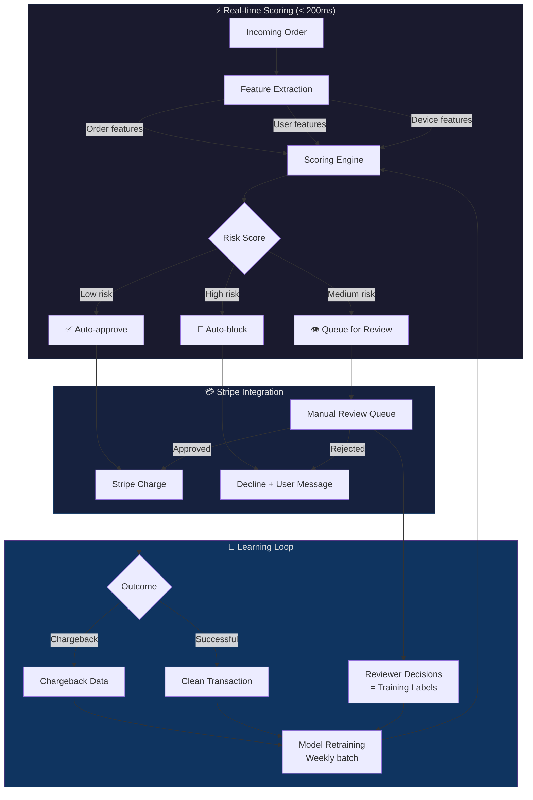

<p align="center">
  
</p>

<h1 align="center">Checkout Optimization — Fraud Detection & Payment Expansion</h1>

<p align="center">
  <strong>How we built a fraud detection engine at 96% precision and expanded payment methods to lift checkout conversion by 6%.</strong>
</p>

<p align="center">
  
  
  
  
  
</p>

<p align="center">
  <a href="#context">Context</a> •
  <a href="#the-two-problems">Problems</a> •
  <a href="#fraud-detection-engine">Fraud Engine</a> •
  <a href="#payment-expansion">Payment Expansion</a> •
  <a href="#results">Results</a> •
  <a href="#lessons-learned">Lessons</a>
</p>

---

> **Note:** This is a product leadership case study, not a code repository. It documents the architecture, decisions, and outcomes of two interconnected checkout initiatives I led at Vivino. No proprietary code is included.

---

## Context

**Company:** [Vivino](https://www.vivino.com) — the world's largest wine marketplace, 50M+ users, operating across 17+ markets.

**My Role:** Global Programme Lead. I owned the end-to-end delivery of both workstreams — fraud detection and payment expansion — coordinating across Engineering, Finance, Customer Support, and Commercial teams (4 departments, 25+ people).

**The Strategic Frame:** These weren't two separate projects. They were two sides of the same checkout optimization coin:
- **Fraud** was costing revenue through chargebacks and manual review overhead
- **Limited payment methods** was costing revenue through cart abandonment

Solving one without the other would have left money on the table. The programme was designed to attack both simultaneously.

---

## The Two Problems

```
┌────────────────────────────────────────────────────────────────┐
│                    CHECKOUT FUNNEL                              │
│                                                                │
│  Add to Cart ──▶ Payment Selection ──▶ Processing ──▶ Success  │
│                        │                    │                  │
│                   ┌────▼────┐          ┌────▼────┐             │
│                   │ DROP-OFF│          │  FRAUD  │             │
│                   │ "My     │          │  $$$    │             │
│                   │ payment │          │ charge- │             │
│                   │ method  │          │ backs + │             │
│                   │ isn't   │          │ manual  │             │
│                   │ here"   │          │ review  │             │
│                   └─────────┘          └─────────┘             │
│                                                                │
│              PAYMENT EXPANSION          FRAUD ENGINE           │
│              solves this ──────────────── solves this           │
└────────────────────────────────────────────────────────────────┘
```

---

## Fraud Detection Engine

### The Challenge

The existing fraud prevention was a combination of Stripe Radar's default rules and manual review by the finance team. This had three problems:

1. **False positives were high** — legitimate orders flagged as fraud, creating customer friction and support tickets
2. **Manual review didn't scale** — every new market meant more orders to review, but the finance team wasn't growing proportionally
3. **Chargebacks were reactive** — we only learned about fraud after the chargeback hit, sometimes weeks later

### Architecture



### Feature Engineering

The scoring engine combined three categories of signals:

```
ORDER FEATURES              USER FEATURES               DEVICE FEATURES
─────────────────          ─────────────────           ─────────────────
• Order value              • Account age                • IP geolocation
• Item count               • Purchase history           • Device fingerprint
• Shipping ≠ billing       • Email domain age           • Browser/OS combo
• First-time buyer flag    • Previous chargebacks       • Velocity (orders/hr
• Gift order flag          • Address change recency       from same device)
• High-risk SKUs           • Payment method age         • VPN/proxy detection
```

### Key Design Decisions

| Decision | Choice | Rationale |
|---|---|---|
| **Three-tier scoring** (not binary) | Low / Medium / High risk | Binary approve/reject forces you to choose between precision and recall. Three tiers let us auto-approve the clear wins, auto-block the obvious fraud, and only manually review the ambiguous middle. |
| **Stripe-native integration** | Built on top of Stripe Radar, not replacing it | Stripe Radar already had strong baseline rules. We added a custom scoring layer on top rather than rebuilding from scratch. Faster to ship, leveraged Stripe's card network data. |
| **Weekly retraining** | Batch, not online learning | Fraud patterns shift slowly (weeks, not hours). Online learning risked overfitting to isolated attacks. Weekly batch with reviewer labels gave stable, auditable model updates. |
| **Reviewer decisions as labels** | Manual review queue doubled as training pipeline | Every time a reviewer approved or rejected an order, that became a labelled training example. The review queue wasn't just a safety net — it was the data flywheel. |

### Precision vs. Recall Tradeoff

```
                    ┌─────────────────────────────────────┐
                    │        THE FRAUD TRADEOFF            │
                    │                                      │
 High Precision ◄──┤  Block fewer, but almost all blocks  │
 (few false pos.)   │  are actual fraud                    │
                    │                                      │
                    │  We chose THIS side.                 │
                    │                                      │
                    │  Why: False positives = angry         │
                    │  customers who never come back.       │
                    │  A missed fraud = a chargeback fee.   │
                    │  Customer lifetime value >> single    │
                    │  chargeback cost.                     │
                    ├──────────────────────────────────────┤
 High Recall    ◄──┤  Catch more fraud, but block some    │
 (few false neg.)   │  legitimate orders too               │
                    └─────────────────────────────────────┘
```

We optimized for **precision** (96%) rather than recall because the cost of blocking a legitimate customer was higher than the cost of missing occasional fraud. A blocked customer might never return. A chargeback, while expensive, was a known and bounded cost.

---

## Payment Expansion

### The Challenge

Vivino operated across 17+ markets but offered a limited set of payment methods. Different markets have strong local preferences:

- **Netherlands** → iDEAL dominates
- **Germany** → Sofort / Giropay preferred
- **Nordics** → Card payments common but Klarna growing
- **Southern Europe** → Credit cards dominant but local methods emerging

Cart abandonment data showed a clear signal: users reached the payment step, didn't see their preferred method, and left.

### Approach

```mermaid
flowchart LR
    subgraph ANALYSIS ["📊 Market Analysis"]
        DATA[Cart Abandonment<br/>Data by Market] --> RANK[Rank Payment<br/>Methods by Impact]
        RANK --> PRIORITY[Priority Matrix:<br/>Market Size × Method Gap]
    end

    subgraph IMPLEMENTATION ["🔧 Implementation"]
        PRIORITY --> STRIPE_PM[Stripe Payment<br/>Methods API]
        STRIPE_PM --> CONFIG[Market-specific<br/>Configuration]
        CONFIG --> CHECKOUT[Dynamic Checkout<br/>UI per Market]
    end

    subgraph MEASUREMENT ["📈 Measurement"]
        CHECKOUT --> AB[A/B Test<br/>per Market]
        AB --> METRICS[Conversion Rate<br/>+ AOV Tracking]
        METRICS --> ITERATE[Iterate:<br/>Next Method]
    end

    style ANALYSIS fill:#1a1a2e,stroke:#16213e,color:#e0e0e0
    style IMPLEMENTATION fill:#16213e,stroke:#0f3460,color:#e0e0e0
    style MEASUREMENT fill:#0f3460,stroke:#533483,color:#e0e0e0
```



### Rollout Strategy

We didn't add all methods everywhere at once. The rollout was sequenced by expected impact:

```
Phase 1 (Highest impact)
├── iDEAL → Netherlands           ← Largest gap between available and preferred
├── Sofort → Germany/Austria       ← High-volume markets with clear preference
└── Bancontact → Belgium

Phase 2 (Medium impact)
├── Klarna → Nordics               ← Growing demand, premium AOV segment
├── Przelewy24 → Poland            ← Market entry support
└── EPS → Austria

Phase 3 (Long tail)
├── Multibanco → Portugal
├── Giropay → Germany (supplement)
└── Additional local methods based on Phase 1-2 data
```

Each new method went through the same cycle: Stripe configuration → market-specific checkout UI → A/B test (2 weeks minimum) → measure conversion impact → go/no-go for full rollout.

---

## Cross-Department Coordination

This programme touched every department differently, and that was the hardest part:

```
┌─────────────────┬────────────────────────────────────────────┐
│  ENGINEERING     │  Built the fraud scoring engine,           │
│                  │  integrated Stripe payment methods,        │
│                  │  dynamic checkout UI                       │
├─────────────────┼────────────────────────────────────────────┤
│  FINANCE         │  Operated the manual review queue,         │
│                  │  validated chargeback reduction,           │
│                  │  approved new payment method contracts     │
├─────────────────┼────────────────────────────────────────────┤
│  CUSTOMER        │  Handled fraud-related support tickets,    │
│  SUPPORT         │  provided false-positive feedback loop,    │
│                  │  trained on new payment method FAQs        │
├─────────────────┼────────────────────────────────────────────┤
│  COMMERCIAL      │  Identified priority markets,              │
│                  │  set conversion targets,                   │
│                  │  provided market-specific requirements     │
└─────────────────┴────────────────────────────────────────────┘
```

My job was to keep these four teams aligned on shared metrics while respecting that each had different incentives. Finance wanted to minimize chargebacks. Commercial wanted to maximize conversion. Customer Support wanted fewer tickets. Engineering wanted clean architecture.

The trick was framing everything around a single north-star metric: **net revenue per checkout attempt**. This metric naturally balanced fraud losses, conversion gains, and support costs.

---

## Results

<table>
  <tr>
    <td align="center"><h2>96%</h2><sub>Fraud Detection Precision</sub></td>
    <td align="center"><h2>+6%</h2><sub>Checkout Conversion Uplift</sub></td>
    <td align="center"><h2>~70%</h2><sub>Reduction in Manual Reviews</sub></td>
  </tr>
  <tr>
    <td align="center"><h2>< 200ms</h2><sub>Fraud Scoring Latency</sub></td>
    <td align="center"><h2>8+</h2><sub>New Payment Methods Added</sub></td>
    <td align="center"><h2>4</h2><sub>Departments Coordinated</sub></td>
  </tr>
</table>

---

## My Role — What I Actually Did

**Programme Design**
- Identified the connection between fraud and payment expansion as two sides of the same checkout optimization problem, and pitched them as a unified programme
- Defined the north-star metric (net revenue per checkout attempt) that aligned all four departments
- Built the business case with Finance: projected chargeback savings + conversion uplift vs. engineering investment

**Fraud Engine**
- Drove the precision-over-recall decision after analyzing customer lifetime value vs. chargeback costs
- Designed the three-tier scoring approach (auto-approve / review / auto-block) to balance automation with human judgment
- Created the feedback loop where manual review decisions became training labels

**Payment Expansion**
- Built the priority matrix: market size × payment method gap × implementation complexity
- Managed the phased rollout across 17+ markets with A/B testing gates between phases
- Negotiated with Stripe on payment method availability and pricing for each market

**Cross-Department Orchestration**
- Ran weekly syncs with leads from all four departments
- Built a shared dashboard showing fraud rates, conversion rates, and support ticket volume in one view
- Resolved competing incentives (Finance wanted stricter fraud rules; Commercial wanted looser ones) through data-driven threshold tuning

---

## Lessons Learned

### 1. Precision > Recall when humans are in the loop
With a manual review queue, false negatives (missed fraud) get a second chance to be caught. False positives (blocked legitimate orders) are immediate, visible, and damage trust. Optimizing for precision was counterintuitive but correct.

### 2. The review queue is the training pipeline
Most teams treat manual review as a cost center. We treated it as a data factory. Every reviewer decision was a labelled example. The queue got smaller over time because it was teaching the model to handle more cases automatically.

### 3. Payment expansion is a logistics problem, not a tech problem
Adding a payment method via Stripe is straightforward technically. The hard part is: which markets first, how do you A/B test fairly when sample sizes vary 10x across markets, who approves the commercial terms, and how do you train support teams on 8 new payment flows simultaneously.

### 4. One north-star metric to rule them all
Four departments with four different success metrics is a recipe for conflict. "Net revenue per checkout attempt" made everyone's work legible to everyone else. When Finance tightened fraud rules and conversion dipped, the metric showed it immediately. When we added iDEAL in the Netherlands and conversion jumped, everyone could see the impact.

### What I'd Do Differently
- **Invest in synthetic fraud data earlier.** We waited too long to augment the training set. Real fraud data is sparse and seasonal. Synthetic generation would have improved the model faster in the early weeks.
- **Automate the A/B test analysis.** We manually computed significance for each payment method test. With 8+ methods across 17 markets, this should have been an automated pipeline from day one.
- **Build the shared dashboard before writing any code.** We built it mid-programme. If I'd had it from week one, the cross-department alignment conversations would have been 5x easier.

---

## Related Projects

- [OmniMind Case Study](https://github.com/migzursan/omnimind-case-study) — Conversational AI chatbot at Vivino (75% ticket deflection)
- [Sancho Voice Agent](https://github.com/migzursan/sancho-voice-agent) — Personal AI assistant with modular integrations
- [migzursan.github.io](https://migzursan.github.io) — Full portfolio

---

<p align="center">
  Built by <a href="https://migzursan.github.io">Miguel Zurbano</a> · Global Programme Lead · AI & Product
</p>
